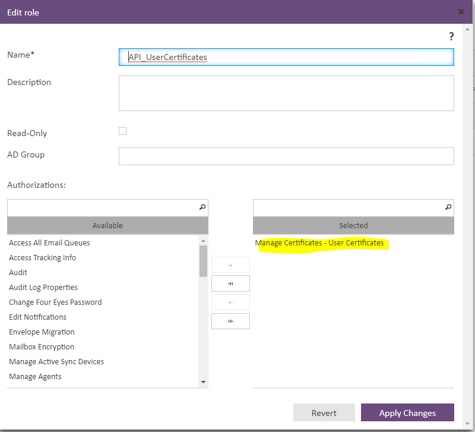

<div id="top"></div>

<!-- PROJECT LOGO -->
<br />
<div align="center">
  <a href="https://www.totemo.com/en/products/email-encryption">
    
  </a>

  <h3 align="center">Totemo Mail KeyServer Query </h3>

  <p align="center">
    · <a href="https://github.com/eizieizi/toemo-keyserver/issues">Report Bug</a>
    · <a href="https://github.com/eizieizi/toemo-keyserver/issues">Request Feature</a>
  </p>
</div>

<br/>
<br/>

<!-- TABLE OF CONTENTS -->
<details>
  <summary>Table of Contents</summary>
  <br/>
  <ol>
    <li>
      <a href="#about-the-project">About Totemo Keyserver</a>
      <ul>
        <li><a href="#built-with">Built With</a></li>
      </ul>
    </li>
    <li>
      <a href="#getting-started">Getting Started</a>
      <ul>
        <li><a href="#prerequisites">Prerequisites</a></li>
        <li><a href="#installation">Installation</a></li>
      </ul>
    </li>
    <li><a href="#usage">Usage</a></li>
    <li><a href="#roadmap">Roadmap</a></li>
    <li><a href="#license">License</a></li>
    <li><a href="#contact">Contact</a></li>
  </ol>
</details>

<br/>
<br/>

## About Totemo Keyserver

This Script allows Users to query Encryption Keys (S/MIME and PGP) for internal Users of totemomail. (https://www.totemo.com/en/products/email-encryption).
The main goal is, to give 3rd partys the possibility to send encrypted emails to internals users to provide a secure communication channel, even on the first email exchange. 

Totemo itself does also provide this functionality, but it does require to specify the own email as well as the recipients email and does send the public keys per email. This makes it uncomfortable to use. (for example, in the email signature).

The Script/Package will spin up a webserver and provides a webinterface to query for public keys. It will also obtain certificates automatically from LetsEncrypt. 

<p align="right">(<a href="#top">back to top</a>)</p>


<!-- GETTING STARTED -->
## Getting Started
<br/>

To install the package, you simply have to download the repository to a Server where docker and docker-compose is installed. You also need to  allow inbound Traffic on Port 80 and 443 from the internet.

You also need to specify a A-Record with your desired FQDN of the totemo-keyserver which has to resolve to the public ip address of the server.


<br/>
<br/>

### Prerequisites

* DNS-Record
* Firewall Rules / NAT
* Enabling Totemo mail API
* User / Password for API User. 

For secutiry purposes, you have to restrict the access of the API Users in the RBAC model of totemo to just allow the user of the script to manage the User certificates. 

See the Screenshot for the necessary permissions:



<br/>

### Installation

To install the script, you have to modify the enviroment Variables in the docker-compose file of the package, which are here specified as tbd.
The NGINX Server configuration automatically uses the SERVER_NAME variable, so this is the only config file to edit. 

```docker
version: "3.7"

services:
  flask:
    build: ./flask
    container_name: flask
    restart: unless-stopped
    environment:
      - TOTEMO_USERNAME=tbd
      - TOTEMO_PASSWORD=tbd
      - TOTEMO_BASEURL=https://totemo01.example.com:8444

    ports:
      - 8080:8080

  nginx:
    image: jonasal/nginx-certbot:latest
    restart: unless-stopped
    environment:
      - CERTBOT_EMAIL=tbd
      - STAGING=0 #1=Use Lets Encrypt Test CA / 0 Use Lets Encrypt Productive CA (with rate-limits)
      - NGINX_ENVSUBST_OUTPUT_DIR=/etc/nginx/user_conf.d/ # More information: https://hub.docker.com/_/nginx
      - SERVER_NAME=keyserver.eizi.at

    ports:
      - 443:443
      - 80:80

    volumes:
      - nginx_secrets:/etc/letsencrypt
      - type: bind
        source: ./nginx/nginx.conf.template
        target: /etc/nginx/templates/nginx.conf.template

volumes:
```


<p align="right">(<a href="#top">back to top</a>)</p>


<!-- USAGE EXAMPLES -->
### Usage


<p align="right">(<a href="#top">back to top</a>)</p>


<!-- ROADMAP -->
### Roadmap

- [x] Add Readme
- [ ] Add possibility to specify email in URL to query - makes it easier for one click email signatures
  


See the [open issues](https://github.com/eizieizi/totemo-keyserver/issues) for a full list of proposed features (and known issues).

<p align="right">(<a href="#top">back to top</a>)</p>


<!-- LICENSE -->
## License

Distributed under the MIT License. See `LICENSE.txt` for more information.

<p align="right">(<a href="#top">back to top</a>)</p>


<!-- CONTACT -->
## Contact

Max Eizenberger - max.eizenberger@nts.eu

<p align="right">(<a href="#top">back to top</a>)</p>
